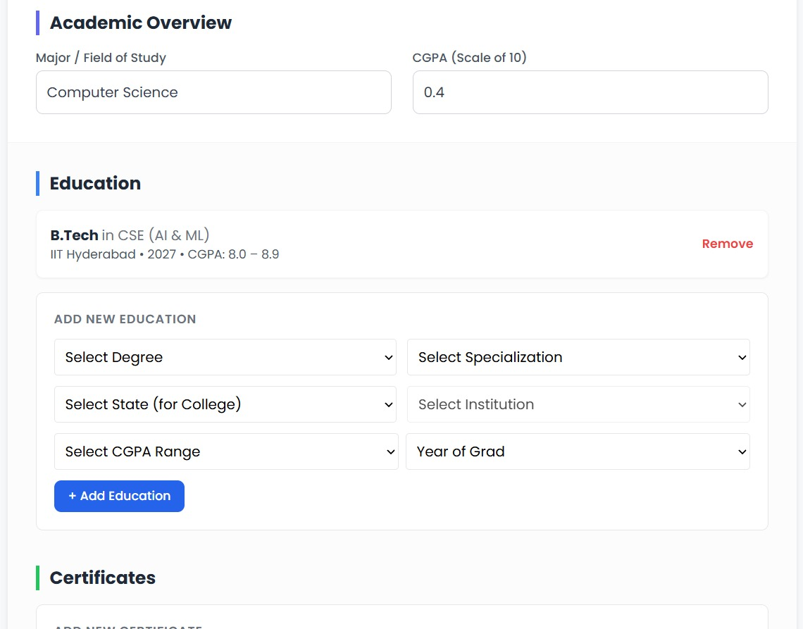
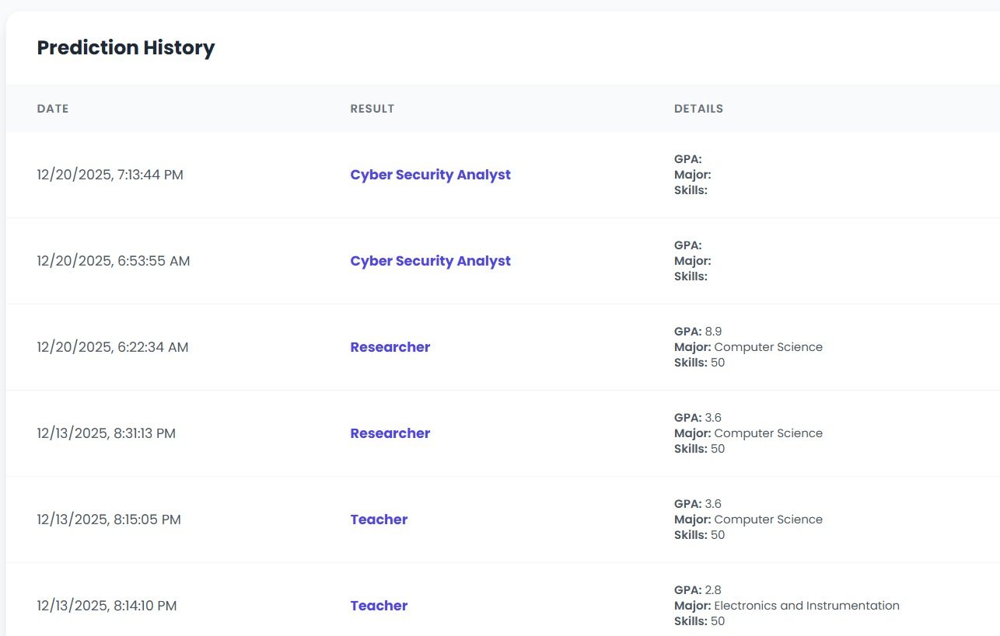

# 🎓 Education to Job Prediction System

A full-stack web application that predicts suitable job roles based on a user’s educational background, skills, and preferences.  
Built using **React** for the frontend, **Django REST Framework** for the backend, and a **Random Forest Machine Learning model**.

---

## 🏠 Home Page

The home page introduces the platform and explains how users can get career predictions based on their education and skills.


---

## 🚀 Features

- 🔐 Secure authentication using JWT
- 🔑 Google OAuth login
- 👤 User profile for entering educational specifications
- 🤖 Machine learning–based job prediction (Random Forest)
- 📊 Dashboard with prediction history
- 🗂 SQLite database for persistence

---

## 🔐 Authentication

### Login Page
Users can log in securely using JWT authentication or Google OAuth.


### Sign Up Page
New users can create an account to access predictions and personalized dashboards.


---

## 👤 Profile Page

Users enter their:
- Education details
- Skills
- Specializations
- Other relevant specifications  

These inputs are used by the ML model to generate predictions.



---

## 🤖 Job Prediction (Machine Learning)

- Algorithm: **Random Forest Classifier**
- Implemented using **Scikit-learn**
- Integrated into Django backend via REST APIs
- Predicts suitable job roles based on user profile data

---

## 📊 Dashboard

The dashboard allows users to:
- View the latest job prediction
- Track history of all previous predictions



---

## 🛠 Tech Stack

### Frontend
- React.js
- React Router
- Axios
- CSS / Bootstrap

### Backend
- Django
- Django REST Framework
- SQLite
- JWT Authentication
- Google OAuth

### Machine Learning
- Python
- Scikit-learn
- Random Forest

---


---

## ⚙️ Installation & Setup

### Backend (Django)

```bash
cd backend
python -m venv venv
venv\Scripts\activate
pip install -r requirements.txt
python manage.py migrate
python manage.py runserver
```
### Frontend (React)

cd frontend
npm install
npm start


